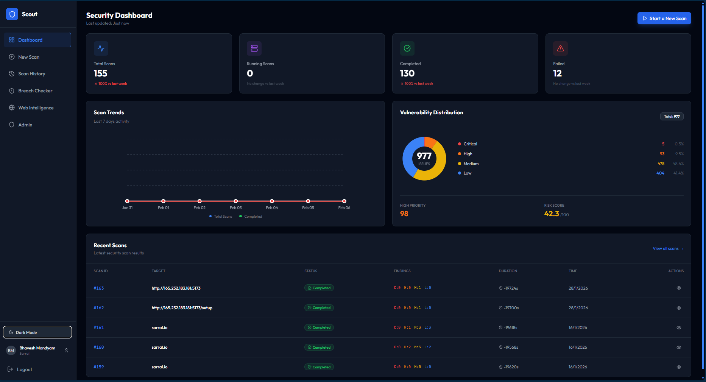

# Sarral-Scan - Advanced Vulnerability Scanner & Pentesting Platform

**Sarral-Scan** is a comprehensive, automated penetration testing and vulnerability scanning platform designed to simplify security assessments. It combines powerful open-source security tools with modern AI analysis to provide real-time insights, detailed reports, and actionable remediation advice.

## 🚀 Features

### 🛡️ Core Security Capabilities

- **Multi-Phase Scanning:** Automated workflow covering Passive Recon, Asset Discovery, Active Recon, Enumeration, and Vulnerability Analysis.
- **Tool Integration:** Orchestrates industry-standard tools including:
  - **Passive Recon:** Whois, NSLookup, Subfinder (Passive), Amass Passive, Assetfinder, WebScraperRecon.
  - **Active Recon:** Nmap Top 1000, WhatWeb, WafW00f, SSLScan.
  - **Asset Discovery:** Subfinder (Full), DNS Resolver, Alive Web Hosts.
  - **Enumeration:** FFUF, Nmap Vulnerability Scan.
  - **Vulnerability Analysis:** SQLMap, Dalfox, Nuclei.
- **Web Intelligence:** Deep dive into HTTP headers, TLS certificates, and technology stacks.

### 🧠 AI-Powered Analysis

- **Gemini Integration:** Uses Google's Gemini AI to analyze raw tool output.
- **Smart Summaries:** Converts complex terminal logs into human-readable executive summaries.
- **Remediation Advice:** Provides AI-generated mitigation strategies for identified vulnerabilities.

### 💻 Modern User Interface

- **Real-Time Updates (SSE):** Built with **Server-Sent Events** for app-wide real-time updates.
  - **Dashboard:** Live counter for running scans.
  - **History:** Auto-refreshing list of scans.
  - **Scan Details:** Live logs and progress bars.
- **Theme Support:** Full **Light & Dark Mode** support.
- **Interactive Reports:** Filter findings by severity, view raw logs, and explore web intelligence data.
- **PDF Reporting:** Generate professional security reports with a single click.

## 🛠️ Technology Stack

### Frontend

- **Framework:** [React 19](https://react.dev/) with [Vite](https://vitejs.dev/)
- **Styling:** [Tailwind CSS](https://tailwindcss.com/)
- **State Management:** Context API (`SSEContext`, `ThemeContext`, `AuthContext`)
- **Animations:** [Framer Motion](https://www.framer.com/motion/)
- **Icons:** [Lucide React](https://lucide.dev/)

### Backend

- **Framework:** [FastAPI](https://fastapi.tiangolo.com/) (Python)
- **Database:** PostgreSQL (via [Prisma ORM](https://prisma-client-py.readthedocs.io/))
- **Task Management:** `asyncio` for concurrent tool execution
- **Remote Execution:** `AsyncSSH` for executing tools on local or remote VMs
- **AI Engine:** Google Generative AI (Gemini)
- **Security:** PyJWT (Authentication), Passlib (Hashing)

## 📦 Deployment

Sarral-Scan is designed to be deployed on a single **Ubuntu 22.04 VM** (e.g., Azure B2s). Use the provided deployment guide to set up the environment, install security tools (Nmap, Go, Nuclei, etc.), and configure Nginx.

👉 **[Read the Full Deployment Guide](DEPLOYMENT.md)**

## 📂 Project Structure

### Backend (`/backend`)

The backend is built with FastAPI and handles the core scanning logic, database interactions, and AI processing.

- **`app/main.py`**: The entry point of the application.
- **`app/services/scan_manager.py`**: The core engine that orchestrates the scanning process.
- **`app/services/event_manager.py`**: Manages Server-Sent Events (SSE) for real-time updates.
- **`app/services/tools.py`**: Handles SSH connections to execute security tools.
- **`prisma/schema.prisma`**: Defines the database schema (Users, Scans, Results).

### Frontend (`/frontend`)

The frontend is a modern React application providing a responsive and interactive user interface.

- **`src/context/SSEContext.tsx`**: Manages the global real-time event stream.
- **`src/pages/Dashboard.tsx`**: High-level statistics and active scan monitoring.
- **`src/pages/ScanDetails.tsx`**: Detailed view of scan progress, results, and AI analysis.
- **`src/pages/History.tsx`**: Searchable archive of past scans.

## 🔒 Security Note

This tool is intended for **authorized security testing and educational purposes only**. Always obtain permission before scanning any target. The developers are not responsible for misuse.

## 🤝 Contributing

Contributions are welcome! Please fork the repository and submit a pull request.
